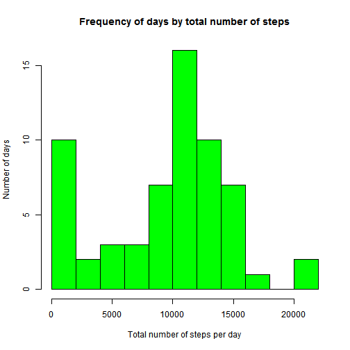
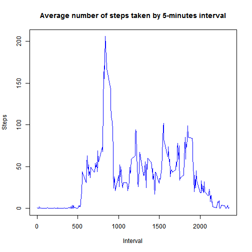

# Reproducible Research: Peer Assessment 1
Prepared by Amperio; last version created Thu May 15 04:00:03 2014


## Loading and preprocessing the data
_**Note**: it is assumed that the data has been obtained in its 'original' form, as a compressed file named 'activity.zip' that contains a file named 'activity.csv' with the actual data. The format of this data file is the one presented in the Assignment introduction._

The steps for loading and processing the data are the following:

1. Read the data from the zipped file (using the 'unz' function within the 'read.csv'), with comma as a separator and using the first row for the filed names:

   
   ```r
   data <- read.csv(unz("activity.zip", "activity.csv"), header = TRUE, sep = ",")
   ```


2. Show some records at the start and the end of the data to make sure that the data has been read correctly:

   
   ```r
   head(data)
   ```
   
   ```
   ##   steps       date interval
   ## 1    NA 2012-10-01        0
   ## 2    NA 2012-10-01        5
   ## 3    NA 2012-10-01       10
   ## 4    NA 2012-10-01       15
   ## 5    NA 2012-10-01       20
   ## 6    NA 2012-10-01       25
   ```
   
   ```r
   tail(data)
   ```
   
   ```
   ##       steps       date interval
   ## 17563    NA 2012-11-30     2330
   ## 17564    NA 2012-11-30     2335
   ## 17565    NA 2012-11-30     2340
   ## 17566    NA 2012-11-30     2345
   ## 17567    NA 2012-11-30     2350
   ## 17568    NA 2012-11-30     2355
   ```


3. As it will be useful later in the analysis, we calculate the average number of steps by 5-minutes intervals across all the days, and store it as a separate column in the data frame:
   
   ```r
   data.steps_by_interval <- split(data$steps, data$interval)
   data.avg_steps_by_interval <- as.integer(lapply(data.steps_by_interval, mean, 
       na.rm = TRUE))
   data <- cbind(data, data.avg_steps_by_interval)
   colnames(data)[4] <- "avg_steps_in_interval"
   ```


4. It will also be useful to identify each date as a 'weekday' or 'weekend'; we therefore transform the 'date' variable into a separate one indicating the weekday number (1 is Monday, 2 is Tuesday, etc.):
   
   ```r
   data.dates_as_numbers <- strftime(as.Date(data$date), format = "%u")
   data <- cbind(data, data.dates_as_numbers)
   colnames(data)[5] <- "weekday_number"
   ```


5. The final data frame is therefore:
   
   ```r
   head(data)
   ```
   
   ```
   ##   steps       date interval avg_steps_in_interval weekday_number
   ## 1    NA 2012-10-01        0                     1              1
   ## 2    NA 2012-10-01        5                     0              1
   ## 3    NA 2012-10-01       10                     0              1
   ## 4    NA 2012-10-01       15                     0              1
   ## 5    NA 2012-10-01       20                     0              1
   ## 6    NA 2012-10-01       25                     2              1
   ```
   
   ```r
   tail(data)
   ```
   
   ```
   ##       steps       date interval avg_steps_in_interval weekday_number
   ## 17563    NA 2012-11-30     2330                     2              5
   ## 17564    NA 2012-11-30     2335                     4              5
   ## 17565    NA 2012-11-30     2340                     3              5
   ## 17566    NA 2012-11-30     2345                     0              5
   ## 17567    NA 2012-11-30     2350                     0              5
   ## 17568    NA 2012-11-30     2355                     1              5
   ```


## What is mean total number of steps taken per day?

1. We create a summary data frame with the total number of steps for each day:
   
   ```r
   data.summary <- as.data.frame(unique(data$date))
   colnames(data.summary)[1] <- "date"
   data.steps_by_day <- split(data$steps, data$date)
   data.summary <- cbind(data.summary, as.integer(lapply(data.steps_by_day, sum, 
       na.rm = TRUE)))
   colnames(data.summary)[2] <- "total_steps"
   head(data.summary)
   ```
   
   ```
   ##         date total_steps
   ## 1 2012-10-01           0
   ## 2 2012-10-02         126
   ## 3 2012-10-03       11352
   ## 4 2012-10-04       12116
   ## 5 2012-10-05       13294
   ## 6 2012-10-06       15420
   ```


2. With this, it is easy to present a histogram of the number of steps per day:
   
   ```r
   hist(data.summary$total_steps, breaks = 10, col = "green", main = "Frequency of days by total number of steps", 
       xlab = "Total number of steps per day", ylab = "Number of days")
   ```
   
    


3. And we can also calculate the mean and median total number of steps for all the days:
   
   ```r
   mean(data.summary$total_steps)
   ```
   
   ```
   ## [1] 9354
   ```
   
   ```r
   median(data.summary$total_steps)
   ```
   
   ```
   ## [1] 10395
   ```


## What is the average daily activity pattern?

1. Here it is useful the precalculated data by 5-minutes interval to show the time series:
   
   ```r
   plot(unique(data$interval), data.avg_steps_by_interval, type = "l", col = "blue", 
       main = "Average number of steps taken by 5-minutes interval", xlab = "Interval", 
       ylab = "Steps")
   ```
   
    


2. As for the calculation of the 5-minute interval with the maximum number of steps on average, the maximum value of steps taken is...
   
   ```r
   max(data.avg_steps_by_interval)
   ```
   
   ```
   ## [1] 206
   ```


   ... which is obtained in the interval number ...
   
   ```r
   which.max(data.avg_steps_by_interval)
   ```
   
   ```
   ## [1] 104
   ```


   ... which corresponds to interval ...
   
   ```r
   unique(data$interval)[which.max(data.avg_steps_by_interval)]
   ```
   
   ```
   ## [1] 835
   ```


   ... that is, in time format:
   
   ```r
   max.interval.name <- as.character(unique(data$interval)[which.max(data.avg_steps_by_interval)])
   max.interval.minutes <- substr(max.interval.name, nchar(max.interval.name) - 
       1, nchar(max.interval.name))
   max.interval.hour <- substr(max.interval.name, 1, nchar(max.interval.name) - 
       nchar(max.interval.minutes))
   cat("The interval with the average maximum number of steps (", max(data.avg_steps_by_interval), 
       " steps) occurred at ", max.interval.hour, " hours and ", max.interval.minutes, 
       " minutes")
   ```
   
   ```
   ## The interval with the average maximum number of steps ( 206  steps) occurred at  8  hours and  35  minutes
   ```


## Imputing missing values


## Are there differences in activity patterns between weekdays and weekends?
