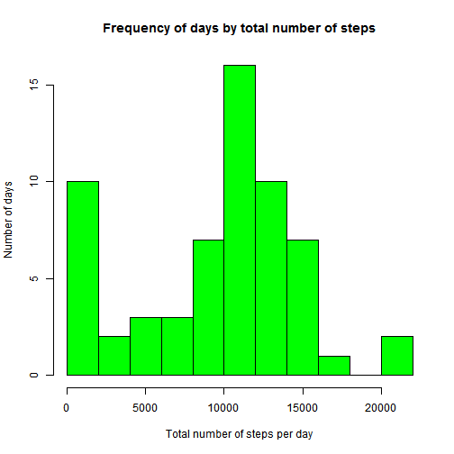
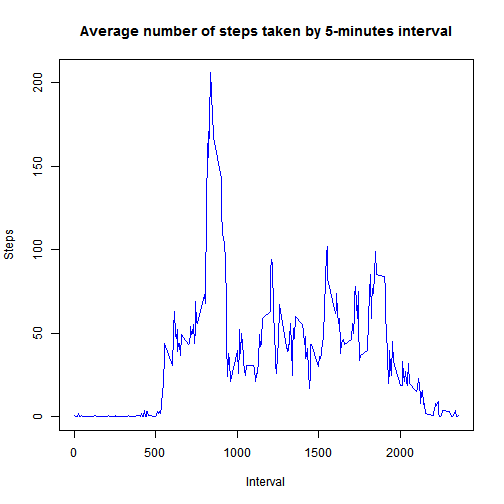
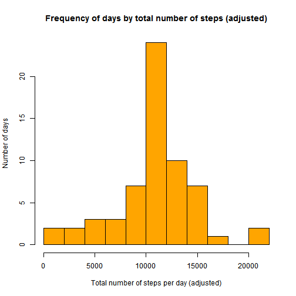
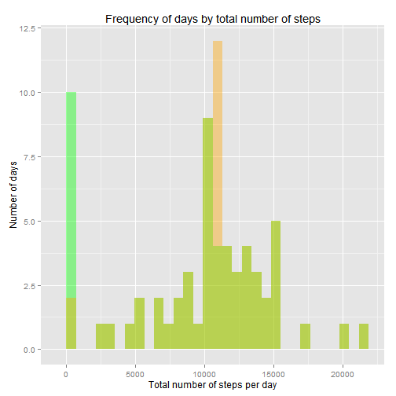
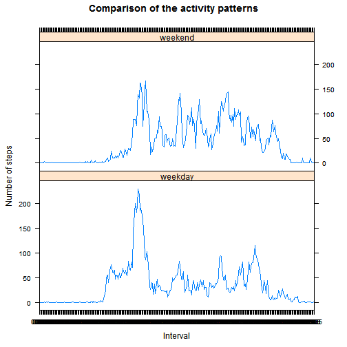

# Reproducible Research: Peer Assessment 1
Prepared by Amperio; last version created Thu May 15 20:45:32 2014


## Loading and preprocessing the data
_**Note**: it is assumed that the data has been obtained in its 'original' form, as a compressed file named 'activity.zip' that contains a file named 'activity.csv' with the actual data. The format of this data file is the one presented in the Assignment introduction._

The steps for loading and processing the data are the following:

1. Read the data from the zipped file (using the 'unz' function within the 'read.csv'), with comma as a separator and using the first row for the filed names:

   
   ```r
   data <- read.csv(unz("activity.zip", "activity.csv"), header = TRUE, sep = ",", 
       stringsAsFactors = FALSE)
   ```


   Show some records at the start and the end of the data to make sure that it has been read correctly:

   
   ```r
   head(data)
   ```
   
   ```
   ##   steps       date interval
   ## 1    NA 2012-10-01        0
   ## 2    NA 2012-10-01        5
   ## 3    NA 2012-10-01       10
   ## 4    NA 2012-10-01       15
   ## 5    NA 2012-10-01       20
   ## 6    NA 2012-10-01       25
   ```
   
   ```r
   tail(data)
   ```
   
   ```
   ##       steps       date interval
   ## 17563    NA 2012-11-30     2330
   ## 17564    NA 2012-11-30     2335
   ## 17565    NA 2012-11-30     2340
   ## 17566    NA 2012-11-30     2345
   ## 17567    NA 2012-11-30     2350
   ## 17568    NA 2012-11-30     2355
   ```

2. We adapt the types and appearance of the 'date' and 'interval' columns, to make them more useful or prettier:
   
   ```r
   # 'date' column as Dates:
   data$date <- as.Date(data$date)
   
   # 'interval' column as 4-characters strings, padded at left with '0':
   data$interval <- as.character(formatC(data$interval, width = 4, flag = "0"))
   
   head(data)
   ```
   
   ```
   ##   steps       date interval
   ## 1    NA 2012-10-01     0000
   ## 2    NA 2012-10-01     0005
   ## 3    NA 2012-10-01     0010
   ## 4    NA 2012-10-01     0015
   ## 5    NA 2012-10-01     0020
   ## 6    NA 2012-10-01     0025
   ```


3. As it will be useful later in the analysis, we calculate the average number of steps by 5-minutes intervals across all the days, and store it as a separate column in the data frame:
   
   ```r
   # Split the data by 'interval':
   data.steps_by_interval <- split(data$steps, data$interval)
   
   # Calculate the average steps by each 'interval', across all days:
   data.avg_steps_by_interval <- as.integer(lapply(data.steps_by_interval, mean, 
       na.rm = TRUE))
   
   # Store the average steps for each 'interval' in the same data.frame:
   data <- data.frame(data, data.avg_steps_by_interval)
   colnames(data)[ncol(data)] <- "avg_steps_in_interval"
   ```


4. It will also be useful to identify each date as a 'weekday' or 'weekend'; thus we create a new factor column using 'strftime' instead of the suggested 'weekdays' as the latter requires managing string constants ('Sunday', 'Monday', etc.) which change depending on the locale (for instance, my machine with a O.S. in Spanish returns 'Domingo' instead of 'Sunday' with 'weekdays'):
   
   ```r
   # Find out what weekday number is each 'date':
   data.dates_as_numbers <- strftime(as.Date(data$date), format = "%u")
   
   # Identify weekends (and, by exclusion, weekdays):
   data.dates_are_weekend <- data.dates_as_numbers == "6" | data.dates_as_numbers == 
       "7"
   
   # Convert the data into a factor and store it in the original data frame:
   data.dates_are_weekend <- factor(data.dates_are_weekend)
   levels(data.dates_are_weekend) <- c("weekday", "weekend")
   data <- data.frame(data, data.dates_are_weekend)
   colnames(data)[ncol(data)] <- "day_type"
   ```


5. The final data frame is therefore:
   
   ```r
   head(data)
   ```
   
   ```
   ##   steps       date interval avg_steps_in_interval day_type
   ## 1    NA 2012-10-01     0000                     1  weekday
   ## 2    NA 2012-10-01     0005                     0  weekday
   ## 3    NA 2012-10-01     0010                     0  weekday
   ## 4    NA 2012-10-01     0015                     0  weekday
   ## 5    NA 2012-10-01     0020                     0  weekday
   ## 6    NA 2012-10-01     0025                     2  weekday
   ```
   
   ```r
   tail(data)
   ```
   
   ```
   ##       steps       date interval avg_steps_in_interval day_type
   ## 17563    NA 2012-11-30     2330                     2  weekday
   ## 17564    NA 2012-11-30     2335                     4  weekday
   ## 17565    NA 2012-11-30     2340                     3  weekday
   ## 17566    NA 2012-11-30     2345                     0  weekday
   ## 17567    NA 2012-11-30     2350                     0  weekday
   ## 17568    NA 2012-11-30     2355                     1  weekday
   ```


## What is mean total number of steps taken per day?

1. We create a summary data frame with the total number of steps for each day:
   
   ```r
   # Create the auxiliary data frame:
   data.summary_by_date <- as.data.frame(unique(data$date))
   colnames(data.summary_by_date)[ncol(data.summary_by_date)] <- "date"
   
   # Split the data by 'date':
   data.steps_by_date <- split(data$steps, data$date)
   
   # Calculate the average steps by each 'date', across all intervals, and
   # store them in the auxiliary data frame:
   data.summary_by_date <- data.frame(data.summary_by_date, as.integer(lapply(data.steps_by_date, 
       sum, na.rm = TRUE)))
   colnames(data.summary_by_date)[ncol(data.summary_by_date)] <- "total_steps"
   head(data.summary_by_date)
   ```
   
   ```
   ##         date total_steps
   ## 1 2012-10-01           0
   ## 2 2012-10-02         126
   ## 3 2012-10-03       11352
   ## 4 2012-10-04       12116
   ## 5 2012-10-05       13294
   ## 6 2012-10-06       15420
   ```


2. With this, it is easy to present a histogram of the number of steps per day:
   
   ```r
   hist(data.summary_by_date$total_steps, breaks = 10, col = "green", main = "Frequency of days by total number of steps", 
       xlab = "Total number of steps per day", ylab = "Number of days")
   ```
   
    


3. And we can also calculate the mean and median total number of steps for all the days:
   
   ```r
   mean(data.summary_by_date$total_steps)
   ```
   
   ```
   ## [1] 9354
   ```
   
   ```r
   median(data.summary_by_date$total_steps)
   ```
   
   ```
   ## [1] 10395
   ```


## What is the average daily activity pattern?

1. Here it is useful the precalculated averages by 5-minutes interval to show the time series:
   
   ```r
   plot(unique(data$interval), data.avg_steps_by_interval, type = "l", col = "blue", 
       main = "Average number of steps taken by 5-minutes interval", xlab = "Interval", 
       ylab = "Steps")
   ```
   
    


2. As for the calculation of the 5-minute interval with the maximum number of steps on average, the maximum value of steps taken is...
   
   ```r
   max(data.avg_steps_by_interval)
   ```
   
   ```
   ## [1] 206
   ```


   ... which is obtained in the interval number ...
   
   ```r
   which.max(data.avg_steps_by_interval)
   ```
   
   ```
   ## [1] 104
   ```


   ... which corresponds to interval ...
   
   ```r
   unique(data$interval)[which.max(data.avg_steps_by_interval)]
   ```
   
   ```
   ## [1] "0835"
   ```


   ... that is, in time format (taking into account the preformatting of the 'interval' column):
   
   ```r
   max.interval.name <- as.character(unique(data$interval)[which.max(data.avg_steps_by_interval)])
   max.interval.hour <- substr(max.interval.name, 1, 2)
   max.interval.minutes <- substr(max.interval.name, 3, 4)
   cat("The interval with the average maximum number of steps (", max(data.avg_steps_by_interval), 
       " steps) occurred at ", max.interval.hour, " hours and ", max.interval.minutes, 
       " minutes")
   ```
   
   ```
   ## The interval with the average maximum number of steps ( 206  steps) occurred at  08  hours and  35  minutes
   ```


## Imputing missing values

1. The number of missing values for the number of steps in the original data is:
   
   ```r
   sum(is.na(data$steps))
   ```
   
   ```
   ## [1] 2304
   ```


2. To fill in these missing values, we use the average for each 5-minutes interval across all the days; this was precalculated when the data was read (see above) and stored in the 'avg_steps_in_interval' column:
   
   ```r
   head(data)
   ```
   
   ```
   ##   steps       date interval avg_steps_in_interval day_type
   ## 1    NA 2012-10-01     0000                     1  weekday
   ## 2    NA 2012-10-01     0005                     0  weekday
   ## 3    NA 2012-10-01     0010                     0  weekday
   ## 4    NA 2012-10-01     0015                     0  weekday
   ## 5    NA 2012-10-01     0020                     0  weekday
   ## 6    NA 2012-10-01     0025                     2  weekday
   ```


3. Now we substitute the missing values using these averages:
   
   ```r
   # Create a new column, initially with the original data for steps:
   data <- data.frame(data, data$steps)
   colnames(data)[ncol(data)] <- "steps_adj"
   
   # Substitute missing values using the average by interval (throws a
   # warning):
   data$steps_adj[is.na(data$steps)] <- data$avg_steps_in_interval
   ```
   
   ```
   ## Warning: número de items para para sustituir no es un múltiplo de la
   ## longitud del reemplazo
   ```
   
   ```r
   head(data)
   ```
   
   ```
   ##   steps       date interval avg_steps_in_interval day_type steps_adj
   ## 1    NA 2012-10-01     0000                     1  weekday         1
   ## 2    NA 2012-10-01     0005                     0  weekday         0
   ## 3    NA 2012-10-01     0010                     0  weekday         0
   ## 4    NA 2012-10-01     0015                     0  weekday         0
   ## 5    NA 2012-10-01     0020                     0  weekday         0
   ## 6    NA 2012-10-01     0025                     2  weekday         2
   ```


4. Thus we can create a new histogram for the total number of steps taken by day:
   
   ```r
   # Calculate the new averages by 'date' (across all intervals):
   data.steps_by_day_adj <- split(data$steps_adj, data$date)
   data.summary_by_date <- data.frame(data.summary_by_date, as.integer(lapply(data.steps_by_day_adj, 
       sum, na.rm = TRUE)))
   colnames(data.summary_by_date)[ncol(data.summary_by_date)] <- "total_steps_adj"
   
   # Display the actual histogram:
   hist(data.summary_by_date$total_steps_adj, breaks = 10, col = "orange", main = "Frequency of days by total number of steps (adjusted)", 
       xlab = "Total number of steps per day (adjusted)", ylab = "Number of days")
   ```
   
    


5. And compare the two histograms:
   
   ```r
   library(ggplot2)
   p <- ggplot(data.summary_by_date, aes(x = total_steps)) + geom_histogram(fill = "green", 
       alpha = 0.4) + geom_histogram(aes(x = total_steps_adj), fill = "orange", 
       alpha = 0.4) + labs(title = "Frequency of days by total number of steps") + 
       xlab("Total number of steps per day") + ylab("Number of days")
   suppressMessages(print(p))
   ```
   
    


6. We can now calculate the new mean and median total number of steps for all the days:
   
   ```r
   mean(data.summary_by_date$total_steps_adj)
   ```
   
   ```
   ## [1] 10750
   ```
   
   ```r
   median(data.summary_by_date$total_steps_adj)
   ```
   
   ```
   ## [1] 10641
   ```


7. We observe that these values are higher than the ones calculated above; however, looking at the histograms we find that it is fact only one of the bars that has 'received' the days wich previously had a small number of steps: it is this bar that increases the values of the mean and the median.

## Are there differences in activity patterns between weekdays and weekends?

1. The calculation of the factor of 'weekdays'/'weekends' was performed above; now first we obtain the average number of steps for the 5-minutes intervals, averaged across either weekdays or weekends, working with the column that includes missing values:
   
   ```r
   # Auxiliary data frame:
   data.summary_by_interval <- as.data.frame(unique(data$interval))
   colnames(data.summary_by_interval)[ncol(data.summary_by_interval)] <- "interval"
   
   # Splitting the data by both 'interval' and 'day_type' (weekdays or
   # weekends):
   data.steps_by_interval_by_day_type <- split(data$steps_adj, list(data$interval, 
       data$day_type))
   
   # Calculate the average steps by 'interval', across all days (separately for
   # weekdays and weekends):
   data.avg_steps_by_interval_by_day_type <- as.integer(lapply(data.steps_by_interval_by_day_type, 
       mean))
   
   # Create auxiliary data frames for data for weekdays...:
   data.summary_by_interval_wd <- data.frame(data.summary_by_interval, data.avg_steps_by_interval_by_day_type[1:288])
   colnames(data.summary_by_interval_wd)[ncol(data.summary_by_interval_wd)] <- "avg_steps"
   data.summary_by_interval_wd <- data.frame(data.summary_by_interval_wd, "weekday")
   colnames(data.summary_by_interval_wd)[ncol(data.summary_by_interval_wd)] <- "day_type"
   
   # ... and for weekends:
   data.summary_by_interval_we <- data.frame(data.summary_by_interval, data.avg_steps_by_interval_by_day_type[289:576])
   colnames(data.summary_by_interval_we)[ncol(data.summary_by_interval_we)] <- "avg_steps"
   data.summary_by_interval_we <- data.frame(data.summary_by_interval_we, "weekend")
   colnames(data.summary_by_interval_we)[ncol(data.summary_by_interval_we)] <- "day_type"
   
   # Merge both auxiliary data frames into one:
   data.summary_by_interval_wd_we <- rbind(data.summary_by_interval_wd, data.summary_by_interval_we)
   head(data.summary_by_interval_wd_we)
   ```
   
   ```
   ##   interval avg_steps day_type
   ## 1     0000         2  weekday
   ## 2     0005         0  weekday
   ## 3     0010         0  weekday
   ## 4     0015         0  weekday
   ## 5     0020         0  weekday
   ## 6     0025         1  weekday
   ```
   
   ```r
   tail(data.summary_by_interval_wd_we)
   ```
   
   ```
   ##     interval avg_steps day_type
   ## 571     2330         1  weekend
   ## 572     2335        11  weekend
   ## 573     2340         6  weekend
   ## 574     2345         1  weekend
   ## 575     2350         0  weekend
   ## 576     2355         0  weekend
   ```


2. Now we present the required plot, taking advantage of the 'day_type' factor in the new data frame:
   
   ```r
   library(lattice)
   xyplot(avg_steps ~ interval | day_type, data = data.summary_by_interval_wd_we, 
       type = c("l", "l"), layout = c(1, 2), xlab = "Interval", ylab = "Number of steps", 
       main = "Comparison of the activity patterns")
   ```
   
    


3. **And that's all, folks!**


